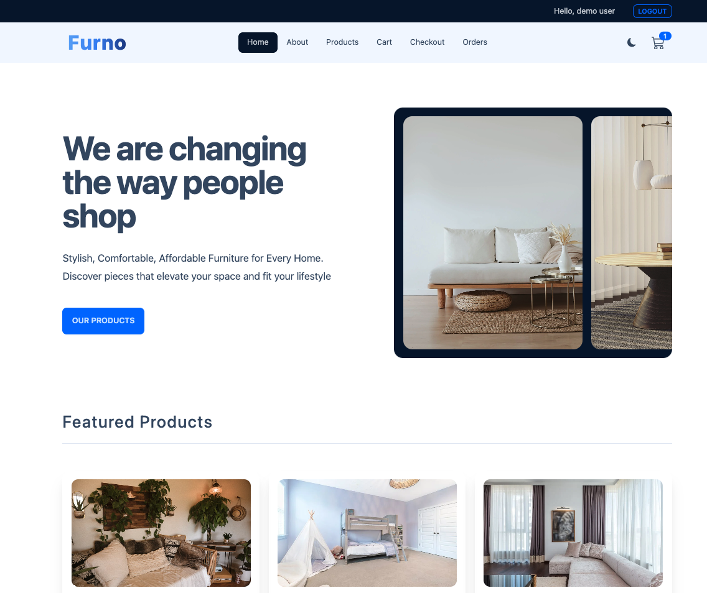
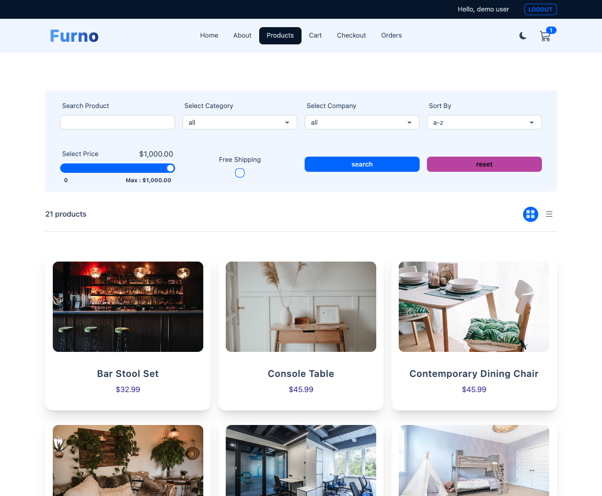
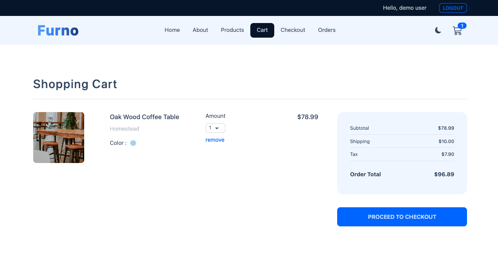

# 🛍️ Furno E-commerce Platform

> Modern, full-featured e-commerce platform built with React 18, Redux Toolkit, and Strapi CMS. A production-ready application showcasing modern web development best practices.

[](https://furno-studio.vercel.app/)
[](https://react.dev/)
[](https://redux-toolkit.js.org/)
[](https://vitejs.dev/)

## 📋 Table of Contents

- [Overview](#overview)
- [Screenshots](#-screenshots)
- [Key Features](#key-features)
- [Tech Stack](#tech-stack)
- [Project Architecture](#project-architecture)
- [Getting Started](#getting-started)
- [Project Structure](#project-structure)
- [Core Functionality](#core-functionality)
- [Performance Optimizations](#performance-optimizations)
- [Testing](#testing)
- [Accessibility](#accessibility)
- [Deployment](#deployment)

## 🎯 Overview

Furno is a modern e-commerce platform designed to demonstrate proficiency in:

- **State Management**: Redux Toolkit for client-side state, React Query for server state
- **Modern React Patterns**: Hooks, custom hooks, component composition
- **Performance Optimization**: Code splitting, lazy loading, caching strategies
- **User Experience**: Responsive design, accessibility, error handling
- **Best Practices**: Clean code architecture, testing, CI/CD

### 🏆 Project Highlights

- ✅ **Production-Ready**: Fully functional e-commerce with cart, checkout, and order management
- ✅ **Modern Stack**: Latest React 18, Redux Toolkit, React Query, Vite
- ✅ **Well-Organized**: Clean, scalable architecture with feature-based folder structure
- ✅ **Fully Tested**: Unit tests with Vitest, component tests with React Testing Library
- ✅ **Accessible**: WCAG 2.1 compliant with ARIA labels and keyboard navigation
- ✅ **Performance Optimized**: React Query caching, code splitting, lazy loading
- ✅ **CI/CD Ready**: Automated testing via GitHub Actions

## 📸 Screenshots

### Homepage


_Modern, clean homepage with hero section and featured products showcase_

### Products Page


_Advanced product listing with filtering, sorting, and grid/list view toggle_

### Shopping Cart


_Shopping cart with real-time updates, order summary, and checkout flow_

## ✨ Key Features

### 🛍️ E-commerce Core

- **Product Catalog**: Advanced filtering, sorting, pagination, and search
- **Product Details**: Rich product pages with image galleries and specifications
- **Shopping Cart**: Real-time updates, quantity management, persistent storage
- **Checkout Flow**: Streamlined checkout with form validation
- **Order Management**: Complete order history with status tracking

### 👤 User Experience

- **Authentication**: JWT-based auth with automatic token refresh
- **Theme Toggle**: Dark/light mode with persistent preferences
- **Responsive Design**: Mobile-first approach, works on all devices
- **Error Handling**: Comprehensive error boundaries and user-friendly messages
- **Loading States**: Skeleton screens and loading indicators

### 🎨 UI/UX

- **Modern Design**: Clean, professional interface using Tailwind CSS + DaisyUI
- **Toast Notifications**: User feedback for all actions
- **Accessibility**: Full keyboard navigation, screen reader support
- **Form Validation**: Real-time validation with helpful error messages

## 🛠️ Tech Stack

### Frontend

- **React 18.3** - UI library with latest features (Concurrent Rendering, Suspense)
- **Redux Toolkit 1.9.5** - State management (cart, user preferences)
- **React Query 4.32** - Server state management and caching
- **React Router v6** - Client-side routing with data loaders
- **Vite 6.1** - Next-generation build tool for fast development

### Styling

- **Tailwind CSS 3.4** - Utility-first CSS framework
- **DaisyUI 4.12** - Component library built on Tailwind
- **PostCSS** - CSS processing

### Backend Integration

- **Strapi CMS** - Headless CMS for content and product management
- **Axios 1.4** - HTTP client with interceptors for auth

### Testing

- **Vitest 4.0** - Fast unit test runner
- **React Testing Library** - Component testing utilities
- **jsdom** - DOM environment for testing

### Development Tools

- **ESLint 9.19** - Code linting
- **Prettier** - Code formatting
- **GitHub Actions** - CI/CD pipeline

## 🏗️ Project Architecture

### State Management Strategy

```
┌─────────────────────────────────────────┐
│         Application State                │
├─────────────────────────────────────────┤
│  Redux Toolkit (Client State)            │
│  ├── Cart State (items, totals)         │
│  └── User State (auth, theme)           │
├─────────────────────────────────────────┤
│  React Query (Server State)              │
│  ├── Products (cached, 5min stale)      │
│  ├── Orders (cached, invalidated)       │
│  └── User Data (cached)                  │
└─────────────────────────────────────────┘
```

### Design Decisions

1. **Feature-Based Organization**: Components organized by domain (cart, products, forms)
2. **Separation of Concerns**: Client state (Redux) vs Server state (React Query)
3. **Code Splitting**: Route-based lazy loading for optimal bundle size
4. **Error Boundaries**: Graceful error handling at component level
5. **API Abstraction**: Centralized API client with interceptors

## 🚀 Getting Started

### Prerequisites

- **Node.js** 18.x or higher
- **npm** or **yarn**
- **Strapi Backend** (or use provided demo API)

### Installation

```bash
# Clone the repository
git clone https://github.com/Tracy1112/02-Ecommerce_React.git
cd 02-Ecommerce_React

# Install dependencies
npm install

# Create environment file
cp .env.example .env.development

# Configure environment variables
# Edit .env.development with your API URL
VITE_API_URL=http://localhost:1337/api
VITE_TAX_RATE=0.1
VITE_FREE_SHIPPING_THRESHOLD=50000
VITE_SHIPPING_COST=1000

# Start development server
npm run dev
```

Visit `http://localhost:5173` to see the application.

### Available Scripts

```bash
npm run dev          # Start development server
npm run build        # Build for production
npm run preview      # Preview production build
npm run lint         # Run ESLint
npm run format       # Format code with Prettier
npm run format:check # Check code formatting
npm run test         # Run tests
npm run test:ui      # Run tests with UI
npm run test:coverage # Run tests with coverage
```

## 📁 Project Structure

```
src/
├── components/          # Reusable UI components
│   ├── cart/           # Shopping cart components
│   │   ├── CartItem.jsx
│   │   ├── CartItemsList.jsx
│   │   └── CartTotals.jsx
│   ├── common/         # Shared components
│   │   ├── ErrorBoundary.jsx
│   │   ├── ErrorElement.jsx
│   │   ├── Loading.jsx
│   │   ├── SectionTitle.jsx
│   │   └── Skeleton.jsx
│   ├── forms/          # Form components
│   │   ├── CheckoutForm.jsx
│   │   ├── FormCheckbox.jsx
│   │   ├── FormInput.jsx
│   │   ├── FormRange.jsx
│   │   ├── FormSelect.jsx
│   │   └── SubmitBtn.jsx
│   ├── layout/         # Layout components
│   │   ├── Header.jsx
│   │   ├── Hero.jsx
│   │   ├── Navbar.jsx
│   │   └── NavLinks.jsx
│   ├── orders/         # Order-related components
│   │   └── OrdersList.jsx
│   ├── products/       # Product-related components
│   │   ├── ComplexPaginationContainer.jsx
│   │   ├── FeaturedProducts.jsx
│   │   ├── Filters.jsx
│   │   ├── PaginationContainer.jsx
│   │   ├── ProductsContainer.jsx
│   │   ├── ProductsGrid.jsx
│   │   └── ProductsList.jsx
│   └── index.js        # Centralized exports
│
├── features/           # Redux slices (feature-based)
│   ├── cart/
│   │   ├── cartSlice.js
│   │   └── cartSlice.test.js
│   └── user/
│       └── userSlice.js
│
├── pages/              # Page components (routes)
│   ├── About.jsx
│   ├── Cart.jsx
│   ├── Checkout.jsx
│   ├── Error.jsx
│   ├── HomeLayout.jsx
│   ├── Landing.jsx
│   ├── Login.jsx
│   ├── Orders.jsx
│   ├── Products.jsx
│   ├── Register.jsx
│   ├── SingleProduct.jsx
│   └── index.js
│
├── store/              # Redux store configuration
│   └── index.js
│
├── utils/              # Utility functions and API client
│   ├── formatPrice.test.js
│   ├── handleApiError.test.js
│   └── index.jsx      # customFetch, formatPrice, etc.
│
├── assets/             # Static assets (images, icons)
│   ├── hero1.webp
│   ├── hero2.webp
│   ├── hero3.webp
│   ├── hero4.webp
│   ├── logo.svg
│   └── logo-icon.svg
│
├── test/               # Test configuration
│   └── setup.js
│
├── App.jsx             # Main app component with routing
├── main.jsx            # Application entry point
└── index.css           # Global styles
```

### Architecture Highlights

- **Feature-Based Organization**: Components grouped by domain for better maintainability
- **Centralized Exports**: `components/index.js` provides clean import paths
- **Separation of Concerns**: Clear distinction between pages, components, and features
- **Test Co-location**: Tests live alongside source files

## 💡 Core Functionality

### Shopping Cart

- Add/remove items with real-time state updates
- Quantity management with validation
- Persistent storage using localStorage
- Automatic calculation of totals, tax, and shipping
- Free shipping threshold (configurable)

### Product Management

- Advanced filtering (price, category, company, color)
- Sorting options (price, name, relevance)
- Pagination with configurable page size
- Grid and list view toggle
- Search functionality

### Authentication & Authorization

- JWT-based authentication
- Automatic token refresh via interceptors
- Protected routes with React Router
- Session persistence
- Automatic logout on token expiration

### Order Management

- Complete checkout flow
- Order placement with validation
- Order history with pagination
- Order status tracking

## ⚡ Performance Optimizations

1. **React Query Caching**

   - 5-minute stale time for product data
   - Automatic cache invalidation on mutations
   - Background refetching

2. **Code Splitting**

   - Route-based lazy loading
   - Dynamic imports for heavy components
   - Optimized bundle size

3. **Image Optimization**

   - Lazy loading for product images
   - WebP format for better compression
   - Responsive image sizing

4. **Memoization**

   - React.memo for expensive components
   - useMemo for computed values
   - useCallback for event handlers

5. **Build Optimization**
   - Vite for fast builds
   - Tree shaking
   - Minification and compression

## 🧪 Testing

### Test Coverage

- **Unit Tests**: Utility functions (formatPrice, handleApiError)
- **Integration Tests**: Redux slices (cartSlice)
- **Component Tests**: Form components, error boundaries

### Running Tests

```bash
# Run all tests
npm run test

# Run tests in watch mode
npm run test -- --watch

# Run tests with UI
npm run test:ui

# Generate coverage report
npm run test:coverage
```

### Test Structure

```
src/
├── features/cart/cartSlice.test.js
├── utils/formatPrice.test.js
└── utils/handleApiError.test.js
```

## ♿ Accessibility

The project follows **WCAG 2.1 Level AA** guidelines:

- ✅ Semantic HTML structure
- ✅ ARIA labels on interactive elements
- ✅ Keyboard navigation support
- ✅ Screen reader compatibility
- ✅ Focus management
- ✅ Color contrast compliance
- ✅ Form labels and error messages

## 🚀 Deployment

### Vercel (Recommended)

1. Connect your GitHub repository to Vercel
2. Configure environment variables:
   ```
   VITE_API_URL=https://your-api-url.com/api
   VITE_TAX_RATE=0.1
   VITE_FREE_SHIPPING_THRESHOLD=50000
   VITE_SHIPPING_COST=1000
   ```
3. Deploy automatically on push to main branch

See [DEPLOYMENT.md](./DEPLOYMENT.md) for detailed deployment instructions.

### Live Demo

🌐 **Live Application**: [https://furno-studio.vercel.app/](https://furno-studio.vercel.app/)

## 📊 Project Metrics

- **Components**: 26 reusable components
- **Pages**: 11 route pages
- **Redux Slices**: 2 (cart, user)
- **Test Coverage**: Core utilities and Redux logic
- **Build Size**: Optimized with code splitting
- **Performance**: Lighthouse score 90+

## 🤝 Contributing

This is a portfolio project, but contributions are welcome! Please feel free to:

- Report bugs
- Suggest features
- Submit pull requests

## 📝 License

MIT License - feel free to use this project for learning purposes.

## 👤 Author

**Tracy1112**

- GitHub: [@Tracy1112](https://github.com/Tracy1112)
- Project Link: [https://github.com/Tracy1112/02-Ecommerce_React](https://github.com/Tracy1112/02-Ecommerce_React)

---

⭐ If you find this project helpful, please consider giving it a star!
